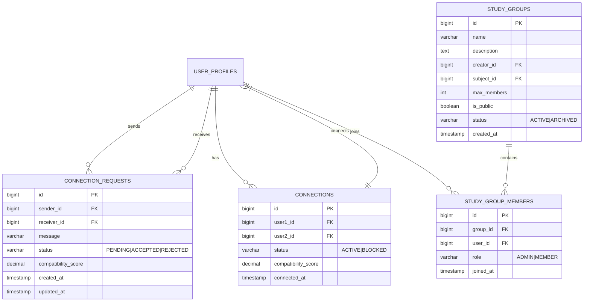
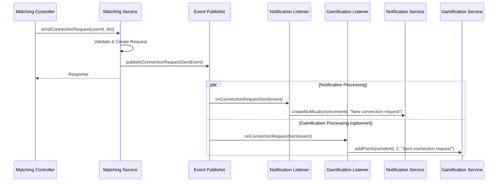
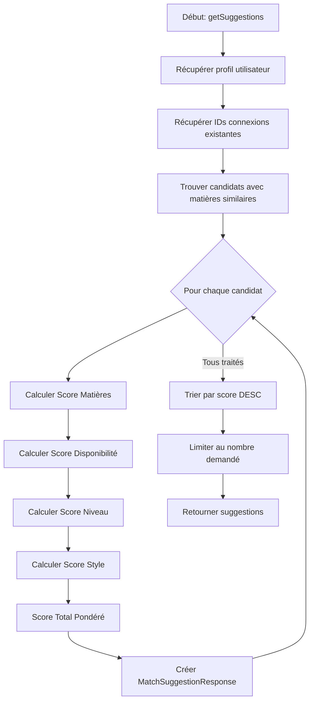
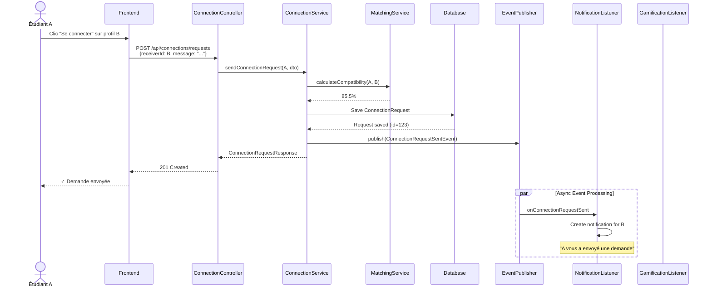
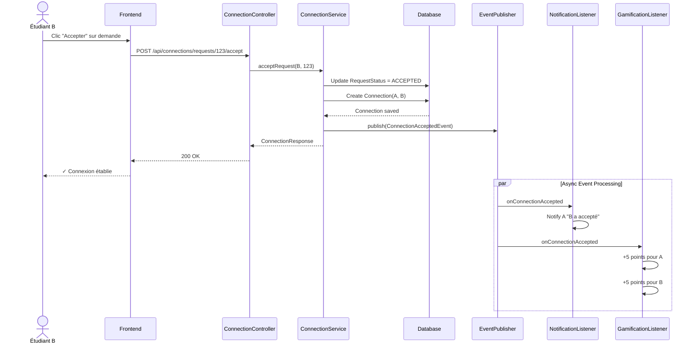
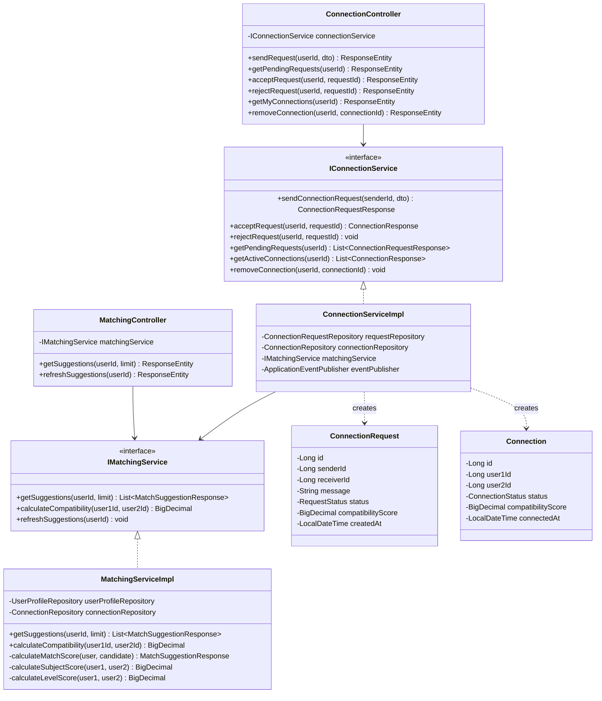

# 🔗 Module Matching & Connexions - Guide d'Implémentation

## 📋 Table des Matières

1. [Vue d'Ensemble](#1-vue-densemble)
2. [Architecture du Module](#2-architecture-du-module)
3. [Structure des Fichiers](#3-structure-des-fichiers)
4. [Modèle de Données](#4-modèle-de-données)
5. [Implémentation Étape par Étape](#5-implémentation-étape-par-étape)
6. [Système d'Événements](#6-système-dévénements)
7. [Communication Inter-Modules](#7-communication-inter-modules)
8. [Algorithme de Matching](#8-algorithme-de-matching)
9. [API REST Endpoints](#9-api-rest-endpoints)
10. [Tests d'Intégration](#10-tests-dintégration)
11. [Diagrammes](#11-diagrammes)

---

## 1. Vue d'Ensemble

### 1.1 Objectif du Module

Le module **Matching & Connexions** permet aux étudiants de :
- Trouver des partenaires d'étude compatibles (algorithme de matching)
- Envoyer/recevoir des demandes de connexion
- Gérer leurs connexions (accepter, refuser, supprimer)
- Créer et rejoindre des groupes d'étude

### 1.2 Fonctionnalités Principales

| ID | Fonctionnalité | Description | Priorité |
|----|----------------|-------------|----------|
| F-M-01 | Algorithme matching | Calculer compatibilité entre étudiants | ⭐⭐⭐ Haute |
| F-M-02 | Suggestions | Proposer des partenaires d'étude | ⭐⭐⭐ Haute |
| F-M-03 | Envoyer demande | Demander connexion avec un étudiant | ⭐⭐⭐ Haute |
| F-M-04 | Accepter/Refuser | Gérer les demandes reçues | ⭐⭐⭐ Haute |
| F-M-05 | Liste connexions | Voir mes connexions actuelles | ⭐⭐⭐ Haute |
| F-M-06 | Créer groupe | Créer un groupe d'étude | ⭐⭐ Moyenne |
| F-M-07 | Rejoindre groupe | Rejoindre un groupe existant | ⭐⭐ Moyenne |
| F-M-08 | Quitter groupe | Quitter un groupe | ⭐⭐ Moyenne |

### 1.3 Interaction avec Autres Modules

```
┌─────────────────────────────────────────────────────────────────────┐
│                        Module Matching                               │
│  ┌──────────────┐  ┌──────────────┐  ┌──────────────┐               │
│  │ Suggestions  │  │ Connexions   │  │ Study Groups │               │
│  └──────────────┘  └──────────────┘  └──────────────┘               │
└─────────────────────────────────────────────────────────────────────┘
        ▲                    │                    │
        │                    ▼                    ▼
┌───────┴───────┐    ┌──────────────┐    ┌──────────────┐
│  User Module  │    │ Notification │    │ Gamification │
│  (Profiles)   │    │   Module     │    │   Module     │
└───────────────┘    └──────────────┘    └──────────────┘
        ▲                    │                    │
        │                    ▼                    ▼
        │            ┌──────────────┐    ┌──────────────┐
        └────────────│  Messaging   │    │  Community   │
                     │   Module     │    │   Module     │
                     └──────────────┘    └──────────────┘
```

---

## 2. Architecture du Module

### 2.1 Architecture en Couches

```
src/main/java/org/example/learnlink/modules/matching/
├── controller/           # REST Controllers
│   ├── ConnectionController.java
│   ├── MatchingController.java
│   └── StudyGroupController.java
├── dto/                  # Data Transfer Objects
│   ├── request/
│   │   ├── ConnectionRequestDto.java
│   │   ├── StudyGroupCreateRequest.java
│   │   └── ConnectionActionRequest.java
│   └── response/
│       ├── MatchSuggestionResponse.java
│       ├── ConnectionResponse.java
│       └── StudyGroupResponse.java
├── entity/               # JPA Entities
│   ├── Connection.java
│   ├── ConnectionRequest.java
│   ├── StudyGroup.java
│   ├── StudyGroupMember.java
│   └── enums/
│       ├── ConnectionStatus.java
│       ├── RequestStatus.java
│       └── GroupRole.java
├── event/                # Domain Events
│   ├── ConnectionRequestSentEvent.java
│   ├── ConnectionAcceptedEvent.java
│   ├── ConnectionRejectedEvent.java
│   ├── StudyGroupCreatedEvent.java
│   └── UserJoinedGroupEvent.java
├── listener/             # Event Listeners
│   ├── MatchingEventListener.java
│   └── ConnectionEventListener.java
├── mapper/               # MapStruct Mappers
│   ├── ConnectionMapper.java
│   ├── MatchingMapper.java
│   └── StudyGroupMapper.java
├── repository/           # JPA Repositories
│   ├── ConnectionRepository.java
│   ├── ConnectionRequestRepository.java
│   ├── StudyGroupRepository.java
│   └── StudyGroupMemberRepository.java
└── service/              # Business Logic
    ├── IConnectionService.java
    ├── ConnectionServiceImpl.java
    ├── IMatchingService.java
    ├── MatchingServiceImpl.java
    ├── MatchingAlgorithm.java
    ├── IStudyGroupService.java
    └── StudyGroupServiceImpl.java
```

---

## 3. Structure des Fichiers

### 3.1 Création des Répertoires

```bash
# Commande PowerShell pour créer la structure
$base = "src/main/java/org/example/learnlink/modules/matching"
$folders = @(
    "controller",
    "dto/request",
    "dto/response",
    "entity/enums",
    "event",
    "listener",
    "mapper",
    "repository",
    "service"
)

foreach ($folder in $folders) {
    New-Item -ItemType Directory -Path "$base/$folder" -Force
}
```

---

## 4. Modèle de Données

### 4.1 Diagramme Entité-Relation



### 4.2 Entités JPA

#### ConnectionRequest.java
```java
package org.example.learnlink.modules.matching.entity;

import jakarta.persistence.*;
import lombok.*;
import org.example.learnlink.modules.matching.entity.enums.RequestStatus;
import org.hibernate.annotations.CreationTimestamp;
import org.hibernate.annotations.UpdateTimestamp;

import java.math.BigDecimal;
import java.time.LocalDateTime;

@Entity
@Table(name = "connection_requests", 
    uniqueConstraints = @UniqueConstraint(
        columnNames = {"sender_id", "receiver_id"}
    ))
@Getter @Setter
@NoArgsConstructor @AllArgsConstructor
@Builder
public class ConnectionRequest {

    @Id
    @GeneratedValue(strategy = GenerationType.IDENTITY)
    private Long id;

    @Column(name = "sender_id", nullable = false)
    private Long senderId;

    @Column(name = "receiver_id", nullable = false)
    private Long receiverId;

    @Column(length = 500)
    private String message;

    @Enumerated(EnumType.STRING)
    @Column(nullable = false)
    @Builder.Default
    private RequestStatus status = RequestStatus.PENDING;

    @Column(name = "compatibility_score", precision = 5, scale = 2)
    private BigDecimal compatibilityScore;

    @CreationTimestamp
    @Column(name = "created_at", nullable = false, updatable = false)
    private LocalDateTime createdAt;

    @UpdateTimestamp
    @Column(name = "updated_at")
    private LocalDateTime updatedAt;
}
```

#### Connection.java
```java
package org.example.learnlink.modules.matching.entity;

import jakarta.persistence.*;
import lombok.*;
import org.example.learnlink.modules.matching.entity.enums.ConnectionStatus;
import org.hibernate.annotations.CreationTimestamp;

import java.math.BigDecimal;
import java.time.LocalDateTime;

@Entity
@Table(name = "connections")
@Getter @Setter
@NoArgsConstructor @AllArgsConstructor
@Builder
public class Connection {

    @Id
    @GeneratedValue(strategy = GenerationType.IDENTITY)
    private Long id;

    @Column(name = "user1_id", nullable = false)
    private Long user1Id;

    @Column(name = "user2_id", nullable = false)
    private Long user2Id;

    @Enumerated(EnumType.STRING)
    @Column(nullable = false)
    @Builder.Default
    private ConnectionStatus status = ConnectionStatus.ACTIVE;

    @Column(name = "compatibility_score", precision = 5, scale = 2)
    private BigDecimal compatibilityScore;

    @CreationTimestamp
    @Column(name = "connected_at", nullable = false)
    private LocalDateTime connectedAt;
}
```

#### StudyGroup.java
```java
package org.example.learnlink.modules.matching.entity;

import jakarta.persistence.*;
import lombok.*;
import org.example.learnlink.modules.matching.entity.enums.GroupStatus;
import org.hibernate.annotations.CreationTimestamp;

import java.time.LocalDateTime;
import java.util.ArrayList;
import java.util.List;

@Entity
@Table(name = "study_groups")
@Getter @Setter
@NoArgsConstructor @AllArgsConstructor
@Builder
public class StudyGroup {

    @Id
    @GeneratedValue(strategy = GenerationType.IDENTITY)
    private Long id;

    @Column(nullable = false, length = 100)
    private String name;

    @Column(columnDefinition = "TEXT")
    private String description;

    @Column(name = "creator_id", nullable = false)
    private Long creatorId;

    @Column(name = "subject_id")
    private Long subjectId;

    @Column(name = "max_members")
    @Builder.Default
    private Integer maxMembers = 10;

    @Column(name = "is_public")
    @Builder.Default
    private Boolean isPublic = true;

    @Enumerated(EnumType.STRING)
    @Builder.Default
    private GroupStatus status = GroupStatus.ACTIVE;

    @OneToMany(mappedBy = "group", cascade = CascadeType.ALL, orphanRemoval = true)
    @Builder.Default
    private List<StudyGroupMember> members = new ArrayList<>();

    @CreationTimestamp
    @Column(name = "created_at", nullable = false)
    private LocalDateTime createdAt;

    public int getMemberCount() {
        return members != null ? members.size() : 0;
    }

    public boolean isFull() {
        return getMemberCount() >= maxMembers;
    }
}
```

#### Enums
```java
// RequestStatus.java
package org.example.learnlink.modules.matching.entity.enums;

public enum RequestStatus {
    PENDING,
    ACCEPTED,
    REJECTED,
    CANCELLED
}

// ConnectionStatus.java
package org.example.learnlink.modules.matching.entity.enums;

public enum ConnectionStatus {
    ACTIVE,
    BLOCKED
}

// GroupStatus.java
package org.example.learnlink.modules.matching.entity.enums;

public enum GroupStatus {
    ACTIVE,
    ARCHIVED,
    DELETED
}

// GroupRole.java
package org.example.learnlink.modules.matching.entity.enums;

public enum GroupRole {
    ADMIN,
    MEMBER
}
```

---

## 5. Implémentation Étape par Étape

### 5.1 Étape 1: Créer les Entités et Enums

1. Créer le package `entity/enums/` avec les 4 enums
2. Créer les 4 entités JPA (ConnectionRequest, Connection, StudyGroup, StudyGroupMember)

### 5.2 Étape 2: Créer les Repositories

```java
// ConnectionRequestRepository.java
package org.example.learnlink.modules.matching.repository;

import org.example.learnlink.modules.matching.entity.ConnectionRequest;
import org.example.learnlink.modules.matching.entity.enums.RequestStatus;
import org.springframework.data.jpa.repository.JpaRepository;
import org.springframework.data.jpa.repository.Query;
import org.springframework.data.repository.query.Param;
import org.springframework.stereotype.Repository;

import java.util.List;
import java.util.Optional;

@Repository
public interface ConnectionRequestRepository extends JpaRepository<ConnectionRequest, Long> {

    // Trouver les demandes reçues (en attente)
    List<ConnectionRequest> findByReceiverIdAndStatus(Long receiverId, RequestStatus status);

    // Trouver les demandes envoyées
    List<ConnectionRequest> findBySenderId(Long senderId);

    // Vérifier si une demande existe déjà entre deux utilisateurs
    @Query("SELECT cr FROM ConnectionRequest cr WHERE " +
           "(cr.senderId = :user1 AND cr.receiverId = :user2) OR " +
           "(cr.senderId = :user2 AND cr.receiverId = :user1)")
    Optional<ConnectionRequest> findBetweenUsers(@Param("user1") Long user1, @Param("user2") Long user2);

    // Compter les demandes en attente pour un utilisateur
    long countByReceiverIdAndStatus(Long receiverId, RequestStatus status);
}
```

```java
// ConnectionRepository.java
package org.example.learnlink.modules.matching.repository;

import org.example.learnlink.modules.matching.entity.Connection;
import org.example.learnlink.modules.matching.entity.enums.ConnectionStatus;
import org.springframework.data.jpa.repository.JpaRepository;
import org.springframework.data.jpa.repository.Query;
import org.springframework.data.repository.query.Param;
import org.springframework.stereotype.Repository;

import java.util.List;
import java.util.Optional;

@Repository
public interface ConnectionRepository extends JpaRepository<Connection, Long> {

    // Trouver toutes les connexions d'un utilisateur
    @Query("SELECT c FROM Connection c WHERE " +
           "(c.user1Id = :userId OR c.user2Id = :userId) AND c.status = :status")
    List<Connection> findByUserIdAndStatus(@Param("userId") Long userId, 
                                           @Param("status") ConnectionStatus status);

    // Vérifier si deux utilisateurs sont connectés
    @Query("SELECT c FROM Connection c WHERE " +
           "((c.user1Id = :user1 AND c.user2Id = :user2) OR " +
           "(c.user1Id = :user2 AND c.user2Id = :user1)) AND c.status = :status")
    Optional<Connection> findActiveBetweenUsers(@Param("user1") Long user1, 
                                                 @Param("user2") Long user2,
                                                 @Param("status") ConnectionStatus status);

    // Compter les connexions actives
    @Query("SELECT COUNT(c) FROM Connection c WHERE " +
           "(c.user1Id = :userId OR c.user2Id = :userId) AND c.status = 'ACTIVE'")
    long countActiveConnectionsByUserId(@Param("userId") Long userId);

    // Obtenir les IDs des utilisateurs connectés
    @Query("SELECT CASE WHEN c.user1Id = :userId THEN c.user2Id ELSE c.user1Id END " +
           "FROM Connection c WHERE (c.user1Id = :userId OR c.user2Id = :userId) " +
           "AND c.status = 'ACTIVE'")
    List<Long> findConnectedUserIds(@Param("userId") Long userId);
}
```

### 5.3 Étape 3: Créer les DTOs

```java
// request/ConnectionRequestDto.java
package org.example.learnlink.modules.matching.dto.request;

import jakarta.validation.constraints.NotNull;
import jakarta.validation.constraints.Size;
import lombok.*;

@Getter @Setter
@NoArgsConstructor @AllArgsConstructor
@Builder
public class ConnectionRequestDto {

    @NotNull(message = "Receiver ID is required")
    private Long receiverId;

    @Size(max = 500, message = "Message must not exceed 500 characters")
    private String message;
}
```

```java
// response/MatchSuggestionResponse.java
package org.example.learnlink.modules.matching.dto.response;

import lombok.*;

import java.math.BigDecimal;
import java.util.List;

@Getter @Setter
@NoArgsConstructor @AllArgsConstructor
@Builder
public class MatchSuggestionResponse {

    private Long userId;
    private String firstName;
    private String lastName;
    private String profilePictureUrl;
    private String bio;
    private String academicLevel;
    
    // Score de compatibilité (0-100)
    private BigDecimal compatibilityScore;
    
    // Détails du matching
    private List<String> commonSubjects;
    private int subjectMatchPercentage;
    private int availabilityMatchPercentage;
    private int levelMatchPercentage;
}
```

```java
// response/ConnectionResponse.java
package org.example.learnlink.modules.matching.dto.response;

import lombok.*;

import java.math.BigDecimal;
import java.time.LocalDateTime;

@Getter @Setter
@NoArgsConstructor @AllArgsConstructor
@Builder
public class ConnectionResponse {

    private Long connectionId;
    private Long connectedUserId;
    private String firstName;
    private String lastName;
    private String profilePictureUrl;
    private String academicLevel;
    private BigDecimal compatibilityScore;
    private LocalDateTime connectedAt;
    private String status;
}
```

### 5.4 Étape 4: Créer les Services

```java
// IMatchingService.java
package org.example.learnlink.modules.matching.service;

import org.example.learnlink.modules.matching.dto.response.MatchSuggestionResponse;

import java.util.List;

public interface IMatchingService {

    /**
     * Obtenir les suggestions de matching pour un utilisateur
     * @param userId ID de l'utilisateur
     * @param limit Nombre maximum de suggestions (défaut: 10)
     * @return Liste des suggestions triées par score de compatibilité
     */
    List<MatchSuggestionResponse> getSuggestions(Long userId, int limit);

    /**
     * Calculer le score de compatibilité entre deux utilisateurs
     * @return Score entre 0 et 100
     */
    java.math.BigDecimal calculateCompatibility(Long user1Id, Long user2Id);

    /**
     * Rafraîchir les suggestions (invalider le cache)
     */
    void refreshSuggestions(Long userId);
}
```

```java
// MatchingServiceImpl.java
package org.example.learnlink.modules.matching.service;

import lombok.RequiredArgsConstructor;
import lombok.extern.slf4j.Slf4j;
import org.example.learnlink.modules.matching.dto.response.MatchSuggestionResponse;
import org.example.learnlink.modules.matching.repository.ConnectionRepository;
import org.example.learnlink.modules.user.entity.UserProfile;
import org.example.learnlink.modules.user.entity.StudentSubject;
import org.example.learnlink.modules.user.repository.UserProfileRepository;
import org.springframework.stereotype.Service;
import org.springframework.transaction.annotation.Transactional;

import java.math.BigDecimal;
import java.math.RoundingMode;
import java.util.*;
import java.util.stream.Collectors;

@Service
@RequiredArgsConstructor
@Slf4j
@Transactional(readOnly = true)
public class MatchingServiceImpl implements IMatchingService {

    private final UserProfileRepository userProfileRepository;
    private final ConnectionRepository connectionRepository;

    // Pondérations de l'algorithme de matching
    private static final BigDecimal SUBJECT_WEIGHT = new BigDecimal("0.40");      // 40%
    private static final BigDecimal AVAILABILITY_WEIGHT = new BigDecimal("0.30"); // 30%
    private static final BigDecimal LEVEL_WEIGHT = new BigDecimal("0.20");        // 20%
    private static final BigDecimal STYLE_WEIGHT = new BigDecimal("0.10");        // 10%

    @Override
    public List<MatchSuggestionResponse> getSuggestions(Long userId, int limit) {
        log.info("Getting match suggestions for user: {}, limit: {}", userId, limit);

        // 1. Récupérer le profil de l'utilisateur
        UserProfile currentUser = userProfileRepository.findByUserId(userId)
            .orElseThrow(() -> new RuntimeException("User profile not found"));

        // 2. Récupérer les IDs des utilisateurs déjà connectés (à exclure)
        List<Long> connectedUserIds = connectionRepository.findConnectedUserIds(userId);
        connectedUserIds.add(userId); // Exclure soi-même

        // 3. Trouver les utilisateurs potentiels avec au moins une matière en commun
        Set<Long> subjectIds = currentUser.getSubjects().stream()
            .map(StudentSubject::getId)
            .collect(Collectors.toSet());

        List<UserProfile> candidates = userProfileRepository.findBySimilarSubjects(
            subjectIds, connectedUserIds, limit * 5); // Récupérer plus pour filtrer

        // 4. Calculer le score pour chaque candidat
        List<MatchSuggestionResponse> suggestions = candidates.stream()
            .map(candidate -> calculateMatchScore(currentUser, candidate))
            .filter(Objects::nonNull)
            .sorted((a, b) -> b.getCompatibilityScore().compareTo(a.getCompatibilityScore()))
            .limit(limit)
            .collect(Collectors.toList());

        log.info("Found {} suggestions for user {}", suggestions.size(), userId);
        return suggestions;
    }

    @Override
    public BigDecimal calculateCompatibility(Long user1Id, Long user2Id) {
        UserProfile user1 = userProfileRepository.findByUserId(user1Id).orElse(null);
        UserProfile user2 = userProfileRepository.findByUserId(user2Id).orElse(null);

        if (user1 == null || user2 == null) {
            return BigDecimal.ZERO;
        }

        return calculateMatchScore(user1, user2).getCompatibilityScore();
    }

    @Override
    public void refreshSuggestions(Long userId) {
        // TODO: Implémenter l'invalidation du cache Redis
        log.info("Refreshing suggestions cache for user: {}", userId);
    }

    /**
     * Calcule le score de matching entre deux utilisateurs
     */
    private MatchSuggestionResponse calculateMatchScore(UserProfile user, UserProfile candidate) {
        // Score Matières (40%)
        BigDecimal subjectScore = calculateSubjectScore(user, candidate);

        // Score Disponibilité (30%) - Simplifié pour l'instant
        BigDecimal availabilityScore = new BigDecimal("70"); // TODO: Implémenter

        // Score Niveau Académique (20%)
        BigDecimal levelScore = calculateLevelScore(user, candidate);

        // Score Style d'apprentissage (10%) - Simplifié pour l'instant
        BigDecimal styleScore = new BigDecimal("50"); // TODO: Implémenter

        // Calcul du score total pondéré
        BigDecimal totalScore = subjectScore.multiply(SUBJECT_WEIGHT)
            .add(availabilityScore.multiply(AVAILABILITY_WEIGHT))
            .add(levelScore.multiply(LEVEL_WEIGHT))
            .add(styleScore.multiply(STYLE_WEIGHT))
            .setScale(2, RoundingMode.HALF_UP);

        // Trouver les matières en commun
        List<String> commonSubjects = findCommonSubjects(user, candidate);

        return MatchSuggestionResponse.builder()
            .userId(candidate.getUserId())
            .firstName(candidate.getFirstName())
            .lastName(candidate.getLastName())
            .profilePictureUrl(candidate.getProfilePictureUrl())
            .bio(candidate.getBio())
            .academicLevel(candidate.getAcademicLevel() != null ? 
                candidate.getAcademicLevel().name() : null)
            .compatibilityScore(totalScore)
            .commonSubjects(commonSubjects)
            .subjectMatchPercentage(subjectScore.intValue())
            .availabilityMatchPercentage(availabilityScore.intValue())
            .levelMatchPercentage(levelScore.intValue())
            .build();
    }

    private BigDecimal calculateSubjectScore(UserProfile user1, UserProfile user2) {
        Set<Long> subjects1 = user1.getSubjects().stream()
            .map(StudentSubject::getId)
            .collect(Collectors.toSet());

        Set<Long> subjects2 = user2.getSubjects().stream()
            .map(StudentSubject::getId)
            .collect(Collectors.toSet());

        if (subjects1.isEmpty() || subjects2.isEmpty()) {
            return BigDecimal.ZERO;
        }

        // Intersection des matières
        Set<Long> common = new HashSet<>(subjects1);
        common.retainAll(subjects2);

        // Score = (matières communes / matières de l'utilisateur 1) * 100
        return new BigDecimal(common.size())
            .divide(new BigDecimal(subjects1.size()), 2, RoundingMode.HALF_UP)
            .multiply(new BigDecimal("100"));
    }

    private BigDecimal calculateLevelScore(UserProfile user1, UserProfile user2) {
        if (user1.getAcademicLevel() == null || user2.getAcademicLevel() == null) {
            return new BigDecimal("50"); // Score neutre si niveau non défini
        }

        int level1 = user1.getAcademicLevel().ordinal();
        int level2 = user2.getAcademicLevel().ordinal();
        int diff = Math.abs(level1 - level2);

        // Plus les niveaux sont proches, plus le score est élevé
        // Différence 0 = 100%, 1 = 75%, 2 = 50%, 3 = 25%, 4+ = 0%
        int score = Math.max(0, 100 - (diff * 25));
        return new BigDecimal(score);
    }

    private List<String> findCommonSubjects(UserProfile user1, UserProfile user2) {
        Set<Long> subjects1Ids = user1.getSubjects().stream()
            .map(StudentSubject::getId)
            .collect(Collectors.toSet());

        return user2.getSubjects().stream()
            .filter(s -> subjects1Ids.contains(s.getId()))
            .map(StudentSubject::getName)
            .collect(Collectors.toList());
    }
}
```

---

## 6. Système d'Événements

### 6.1 Pourquoi Utiliser les Événements?

Les événements permettent un **couplage lâche** entre les modules. Quand une action se produit dans le module Matching, d'autres modules peuvent réagir sans dépendance directe.

### 6.2 Événements du Module Matching

```java
// event/ConnectionRequestSentEvent.java
package org.example.learnlink.modules.matching.event;

import lombok.Getter;
import org.springframework.context.ApplicationEvent;

import java.math.BigDecimal;

@Getter
public class ConnectionRequestSentEvent extends ApplicationEvent {

    private final Long requestId;
    private final Long senderId;
    private final Long receiverId;
    private final BigDecimal compatibilityScore;

    public ConnectionRequestSentEvent(Object source, Long requestId, 
            Long senderId, Long receiverId, BigDecimal compatibilityScore) {
        super(source);
        this.requestId = requestId;
        this.senderId = senderId;
        this.receiverId = receiverId;
        this.compatibilityScore = compatibilityScore;
    }
}
```

```java
// event/ConnectionAcceptedEvent.java
package org.example.learnlink.modules.matching.event;

import lombok.Getter;
import org.springframework.context.ApplicationEvent;

@Getter
public class ConnectionAcceptedEvent extends ApplicationEvent {

    private final Long connectionId;
    private final Long user1Id;
    private final Long user2Id;

    public ConnectionAcceptedEvent(Object source, Long connectionId, 
            Long user1Id, Long user2Id) {
        super(source);
        this.connectionId = connectionId;
        this.user1Id = user1Id;
        this.user2Id = user2Id;
    }
}
```

```java
// event/StudyGroupCreatedEvent.java
package org.example.learnlink.modules.matching.event;

import lombok.Getter;
import org.springframework.context.ApplicationEvent;

@Getter
public class StudyGroupCreatedEvent extends ApplicationEvent {

    private final Long groupId;
    private final Long creatorId;
    private final String groupName;

    public StudyGroupCreatedEvent(Object source, Long groupId, 
            Long creatorId, String groupName) {
        super(source);
        this.groupId = groupId;
        this.creatorId = creatorId;
        this.groupName = groupName;
    }
}
```

### 6.3 Publication d'Événements

Dans le service, publiez les événements après les actions:

```java
// Dans ConnectionServiceImpl.java
@Service
@RequiredArgsConstructor
@Slf4j
@Transactional
public class ConnectionServiceImpl implements IConnectionService {

    private final ConnectionRequestRepository requestRepository;
    private final ConnectionRepository connectionRepository;
    private final IMatchingService matchingService;
    private final ApplicationEventPublisher eventPublisher;

    @Override
    public ConnectionRequestResponse sendConnectionRequest(Long senderId, ConnectionRequestDto dto) {
        log.info("User {} sending connection request to {}", senderId, dto.getReceiverId());

        // Vérifier qu'ils ne sont pas déjà connectés
        connectionRepository.findActiveBetweenUsers(senderId, dto.getReceiverId(), 
                ConnectionStatus.ACTIVE)
            .ifPresent(c -> {
                throw new IllegalStateException("Users are already connected");
            });

        // Calculer le score de compatibilité
        BigDecimal score = matchingService.calculateCompatibility(senderId, dto.getReceiverId());

        // Créer la demande
        ConnectionRequest request = ConnectionRequest.builder()
            .senderId(senderId)
            .receiverId(dto.getReceiverId())
            .message(dto.getMessage())
            .compatibilityScore(score)
            .status(RequestStatus.PENDING)
            .build();

        ConnectionRequest saved = requestRepository.save(request);

        // 🔔 PUBLIER L'ÉVÉNEMENT
        eventPublisher.publishEvent(new ConnectionRequestSentEvent(
            this, saved.getId(), senderId, dto.getReceiverId(), score
        ));

        return mapper.toResponse(saved);
    }

    @Override
    public ConnectionResponse acceptRequest(Long userId, Long requestId) {
        ConnectionRequest request = requestRepository.findById(requestId)
            .orElseThrow(() -> new ResourceNotFoundException("ConnectionRequest", "id", requestId));

        if (!request.getReceiverId().equals(userId)) {
            throw new IllegalStateException("Only the receiver can accept the request");
        }

        request.setStatus(RequestStatus.ACCEPTED);
        requestRepository.save(request);

        // Créer la connexion
        Connection connection = Connection.builder()
            .user1Id(request.getSenderId())
            .user2Id(request.getReceiverId())
            .compatibilityScore(request.getCompatibilityScore())
            .status(ConnectionStatus.ACTIVE)
            .build();

        Connection saved = connectionRepository.save(connection);

        // 🔔 PUBLIER L'ÉVÉNEMENT
        eventPublisher.publishEvent(new ConnectionAcceptedEvent(
            this, saved.getId(), request.getSenderId(), request.getReceiverId()
        ));

        return mapper.toConnectionResponse(saved, request.getSenderId());
    }
}
```

---

## 7. Communication Inter-Modules

### 7.1 Diagramme de Communication



### 7.2 Listeners dans Autres Modules

#### Listener dans Module Notification (à créer)

```java
// modules/notification/listener/MatchingEventListener.java
package org.example.learnlink.modules.notification.listener;

import lombok.RequiredArgsConstructor;
import lombok.extern.slf4j.Slf4j;
import org.example.learnlink.modules.matching.event.ConnectionAcceptedEvent;
import org.example.learnlink.modules.matching.event.ConnectionRequestSentEvent;
import org.example.learnlink.modules.matching.event.StudyGroupCreatedEvent;
import org.example.learnlink.modules.notification.service.INotificationService;
import org.springframework.context.event.EventListener;
import org.springframework.scheduling.annotation.Async;
import org.springframework.stereotype.Component;

@Component
@RequiredArgsConstructor
@Slf4j
public class MatchingEventListener {

    private final INotificationService notificationService;

    @EventListener
    @Async  // Traitement asynchrone pour ne pas bloquer
    public void onConnectionRequestSent(ConnectionRequestSentEvent event) {
        log.info("Handling ConnectionRequestSentEvent: sender={}, receiver={}", 
            event.getSenderId(), event.getReceiverId());

        notificationService.createNotification(
            event.getReceiverId(),
            "CONNECTION_REQUEST",
            "Vous avez reçu une nouvelle demande de connexion",
            event.getSenderId().toString()  // Data pour lien vers le profil
        );
    }

    @EventListener
    @Async
    public void onConnectionAccepted(ConnectionAcceptedEvent event) {
        log.info("Handling ConnectionAcceptedEvent: user1={}, user2={}", 
            event.getUser1Id(), event.getUser2Id());

        // Notifier celui qui a envoyé la demande initiale
        notificationService.createNotification(
            event.getUser1Id(),
            "CONNECTION_ACCEPTED",
            "Votre demande de connexion a été acceptée !",
            event.getUser2Id().toString()
        );
    }

    @EventListener
    @Async
    public void onStudyGroupCreated(StudyGroupCreatedEvent event) {
        log.info("Handling StudyGroupCreatedEvent: groupId={}, creator={}", 
            event.getGroupId(), event.getCreatorId());

        // Notification facultative pour le créateur
        notificationService.createNotification(
            event.getCreatorId(),
            "GROUP_CREATED",
            "Votre groupe '" + event.getGroupName() + "' a été créé !",
            event.getGroupId().toString()
        );
    }
}
```

#### Listener dans Module Gamification (à créer)

```java
// modules/gamification/listener/MatchingGamificationListener.java
package org.example.learnlink.modules.gamification.listener;

import lombok.RequiredArgsConstructor;
import lombok.extern.slf4j.Slf4j;
import org.example.learnlink.modules.matching.event.ConnectionAcceptedEvent;
import org.example.learnlink.modules.matching.event.ConnectionRequestSentEvent;
import org.example.learnlink.modules.matching.event.StudyGroupCreatedEvent;
import org.example.learnlink.modules.gamification.service.IScoreService;
import org.springframework.context.event.EventListener;
import org.springframework.scheduling.annotation.Async;
import org.springframework.stereotype.Component;

@Component
@RequiredArgsConstructor
@Slf4j
public class MatchingGamificationListener {

    private final IScoreService scoreService;

    // Points attribués selon les actions
    private static final int POINTS_CONNECTION_REQUEST = 2;
    private static final int POINTS_CONNECTION_ACCEPTED = 5;
    private static final int POINTS_GROUP_CREATED = 15;
    private static final int POINTS_GROUP_JOINED = 5;

    @EventListener
    @Async
    public void onConnectionAccepted(ConnectionAcceptedEvent event) {
        log.info("Awarding points for accepted connection");

        // Points pour les deux utilisateurs
        scoreService.addPoints(event.getUser1Id(), POINTS_CONNECTION_ACCEPTED, 
            "Connexion établie");
        scoreService.addPoints(event.getUser2Id(), POINTS_CONNECTION_ACCEPTED, 
            "Connexion établie");
    }

    @EventListener
    @Async
    public void onStudyGroupCreated(StudyGroupCreatedEvent event) {
        log.info("Awarding points for group creation");

        scoreService.addPoints(event.getCreatorId(), POINTS_GROUP_CREATED, 
            "Groupe d'étude créé: " + event.getGroupName());
    }
}
```

### 7.3 Configuration Asynchrone

Pour que `@Async` fonctionne, ajoutez la configuration:

```java
// config/AsyncConfig.java
package org.example.learnlink.config;

import org.springframework.context.annotation.Configuration;
import org.springframework.scheduling.annotation.EnableAsync;

@Configuration
@EnableAsync
public class AsyncConfig {
    // Configuration par défaut suffisante pour commencer
}
```

---

## 8. Algorithme de Matching

### 8.1 Formule de Compatibilité

```
Score Total = (Score_Matières × 0.40) + (Score_Disponibilité × 0.30) 
            + (Score_Niveau × 0.20) + (Score_Style × 0.10)
```

### 8.2 Détail des Scores

#### Score Matières (40%)
```java
// Pourcentage de matières en commun
score = (nombre_matières_communes / total_matières_user1) × 100
```

#### Score Disponibilité (30%)
```java
// Overlap des créneaux de disponibilité
// À implémenter avec un champ availability: Map<DayOfWeek, List<TimeSlot>>
```

#### Score Niveau Académique (20%)
```java
// Basé sur la proximité des niveaux
// Même niveau = 100%, 1 niveau de diff = 75%, 2 = 50%, 3 = 25%, 4+ = 0%
score = max(0, 100 - (différence_niveau × 25))
```

#### Score Style d'Apprentissage (10%)
```java
// À implémenter: VISUAL, AUDITORY, READING_WRITING, KINESTHETIC
// Même style = 100%, Différent = 50%
```

### 8.3 Diagramme de l'Algorithme



---

## 9. API REST Endpoints

### 9.1 Matching Controller

```java
// controller/MatchingController.java
package org.example.learnlink.modules.matching.controller;

import jakarta.validation.Valid;
import lombok.RequiredArgsConstructor;
import org.example.learnlink.modules.matching.dto.response.MatchSuggestionResponse;
import org.example.learnlink.modules.matching.service.IMatchingService;
import org.springframework.http.ResponseEntity;
import org.springframework.web.bind.annotation.*;

import java.util.List;

@RestController
@RequestMapping("/api/matching")
@RequiredArgsConstructor
public class MatchingController {

    private final IMatchingService matchingService;

    /**
     * GET /api/matching/suggestions?limit=10
     * Obtenir les suggestions de partenaires d'étude
     */
    @GetMapping("/suggestions")
    public ResponseEntity<List<MatchSuggestionResponse>> getSuggestions(
            @RequestHeader("X-User-Id") Long userId,  // Ou extraire du JWT
            @RequestParam(defaultValue = "10") int limit) {
        
        List<MatchSuggestionResponse> suggestions = matchingService.getSuggestions(userId, limit);
        return ResponseEntity.ok(suggestions);
    }

    /**
     * POST /api/matching/suggestions/refresh
     * Rafraîchir les suggestions (invalider cache)
     */
    @PostMapping("/suggestions/refresh")
    public ResponseEntity<Void> refreshSuggestions(
            @RequestHeader("X-User-Id") Long userId) {
        
        matchingService.refreshSuggestions(userId);
        return ResponseEntity.noContent().build();
    }
}
```

### 9.2 Connection Controller

```java
// controller/ConnectionController.java
package org.example.learnlink.modules.matching.controller;

import jakarta.validation.Valid;
import lombok.RequiredArgsConstructor;
import org.example.learnlink.modules.matching.dto.request.ConnectionRequestDto;
import org.example.learnlink.modules.matching.dto.response.ConnectionRequestResponse;
import org.example.learnlink.modules.matching.dto.response.ConnectionResponse;
import org.example.learnlink.modules.matching.service.IConnectionService;
import org.springframework.http.HttpStatus;
import org.springframework.http.ResponseEntity;
import org.springframework.web.bind.annotation.*;

import java.util.List;

@RestController
@RequestMapping("/api/connections")
@RequiredArgsConstructor
public class ConnectionController {

    private final IConnectionService connectionService;

    /**
     * POST /api/connections/requests
     * Envoyer une demande de connexion
     */
    @PostMapping("/requests")
    public ResponseEntity<ConnectionRequestResponse> sendRequest(
            @RequestHeader("X-User-Id") Long userId,
            @Valid @RequestBody ConnectionRequestDto dto) {
        
        ConnectionRequestResponse response = connectionService.sendConnectionRequest(userId, dto);
        return ResponseEntity.status(HttpStatus.CREATED).body(response);
    }

    /**
     * GET /api/connections/requests/pending
     * Obtenir les demandes en attente (reçues)
     */
    @GetMapping("/requests/pending")
    public ResponseEntity<List<ConnectionRequestResponse>> getPendingRequests(
            @RequestHeader("X-User-Id") Long userId) {
        
        List<ConnectionRequestResponse> requests = connectionService.getPendingRequests(userId);
        return ResponseEntity.ok(requests);
    }

    /**
     * POST /api/connections/requests/{requestId}/accept
     * Accepter une demande de connexion
     */
    @PostMapping("/requests/{requestId}/accept")
    public ResponseEntity<ConnectionResponse> acceptRequest(
            @RequestHeader("X-User-Id") Long userId,
            @PathVariable Long requestId) {
        
        ConnectionResponse response = connectionService.acceptRequest(userId, requestId);
        return ResponseEntity.ok(response);
    }

    /**
     * POST /api/connections/requests/{requestId}/reject
     * Refuser une demande de connexion
     */
    @PostMapping("/requests/{requestId}/reject")
    public ResponseEntity<Void> rejectRequest(
            @RequestHeader("X-User-Id") Long userId,
            @PathVariable Long requestId) {
        
        connectionService.rejectRequest(userId, requestId);
        return ResponseEntity.noContent().build();
    }

    /**
     * GET /api/connections
     * Obtenir toutes mes connexions actives
     */
    @GetMapping
    public ResponseEntity<List<ConnectionResponse>> getMyConnections(
            @RequestHeader("X-User-Id") Long userId) {
        
        List<ConnectionResponse> connections = connectionService.getActiveConnections(userId);
        return ResponseEntity.ok(connections);
    }

    /**
     * DELETE /api/connections/{connectionId}
     * Supprimer une connexion
     */
    @DeleteMapping("/{connectionId}")
    public ResponseEntity<Void> removeConnection(
            @RequestHeader("X-User-Id") Long userId,
            @PathVariable Long connectionId) {
        
        connectionService.removeConnection(userId, connectionId);
        return ResponseEntity.noContent().build();
    }
}
```

### 9.3 Résumé des Endpoints

| Méthode | Endpoint | Description |
|---------|----------|-------------|
| GET | `/api/matching/suggestions` | Obtenir suggestions de matching |
| POST | `/api/matching/suggestions/refresh` | Rafraîchir le cache |
| POST | `/api/connections/requests` | Envoyer demande de connexion |
| GET | `/api/connections/requests/pending` | Demandes reçues en attente |
| POST | `/api/connections/requests/{id}/accept` | Accepter une demande |
| POST | `/api/connections/requests/{id}/reject` | Refuser une demande |
| GET | `/api/connections` | Mes connexions actives |
| DELETE | `/api/connections/{id}` | Supprimer une connexion |

---

## 10. Tests d'Intégration

### 10.1 Test du Repository

```java
// test/.../matching/repository/ConnectionRepositoryIntegrationTest.java
package org.example.learnlink.modules.matching.repository;

import org.example.learnlink.modules.matching.entity.Connection;
import org.example.learnlink.modules.matching.entity.enums.ConnectionStatus;
import org.junit.jupiter.api.BeforeEach;
import org.junit.jupiter.api.Test;
import org.springframework.beans.factory.annotation.Autowired;
import org.springframework.boot.test.autoconfigure.orm.jpa.DataJpaTest;
import org.springframework.test.context.ActiveProfiles;

import java.math.BigDecimal;
import java.util.List;
import java.util.Optional;

import static org.assertj.core.api.Assertions.assertThat;

@DataJpaTest
@ActiveProfiles("test")
class ConnectionRepositoryIntegrationTest {

    @Autowired
    private ConnectionRepository connectionRepository;

    @BeforeEach
    void setUp() {
        connectionRepository.deleteAll();
    }

    @Test
    void shouldFindConnectionBetweenUsers() {
        // Given
        Connection connection = Connection.builder()
            .user1Id(1L)
            .user2Id(2L)
            .compatibilityScore(new BigDecimal("85.50"))
            .status(ConnectionStatus.ACTIVE)
            .build();
        connectionRepository.save(connection);

        // When - chercher dans les deux sens
        Optional<Connection> found1 = connectionRepository.findActiveBetweenUsers(
            1L, 2L, ConnectionStatus.ACTIVE);
        Optional<Connection> found2 = connectionRepository.findActiveBetweenUsers(
            2L, 1L, ConnectionStatus.ACTIVE);

        // Then
        assertThat(found1).isPresent();
        assertThat(found2).isPresent();
        assertThat(found1.get().getId()).isEqualTo(found2.get().getId());
    }

    @Test
    void shouldFindConnectedUserIds() {
        // Given
        connectionRepository.save(Connection.builder()
            .user1Id(1L).user2Id(2L).status(ConnectionStatus.ACTIVE).build());
        connectionRepository.save(Connection.builder()
            .user1Id(3L).user2Id(1L).status(ConnectionStatus.ACTIVE).build());
        connectionRepository.save(Connection.builder()
            .user1Id(1L).user2Id(4L).status(ConnectionStatus.BLOCKED).build());

        // When
        List<Long> connectedIds = connectionRepository.findConnectedUserIds(1L);

        // Then - devrait inclure 2 et 3, mais pas 4 (bloqué)
        assertThat(connectedIds).hasSize(2);
        assertThat(connectedIds).contains(2L, 3L);
    }
}
```

### 10.2 Test du Service

```java
// test/.../matching/service/MatchingServiceIntegrationTest.java
package org.example.learnlink.modules.matching.service;

import org.example.learnlink.modules.matching.dto.response.MatchSuggestionResponse;
import org.example.learnlink.modules.user.entity.AcademicLevel;
import org.example.learnlink.modules.user.entity.StudentSubject;
import org.example.learnlink.modules.user.entity.UserProfile;
import org.example.learnlink.modules.user.repository.StudentSubjectRepository;
import org.example.learnlink.modules.user.repository.UserProfileRepository;
import org.junit.jupiter.api.BeforeEach;
import org.junit.jupiter.api.Test;
import org.springframework.beans.factory.annotation.Autowired;
import org.springframework.boot.test.context.SpringBootTest;
import org.springframework.test.context.ActiveProfiles;
import org.springframework.transaction.annotation.Transactional;

import java.util.List;

import static org.assertj.core.api.Assertions.assertThat;

@SpringBootTest
@ActiveProfiles("test")
@Transactional
class MatchingServiceIntegrationTest {

    @Autowired
    private IMatchingService matchingService;

    @Autowired
    private UserProfileRepository userProfileRepository;

    @Autowired
    private StudentSubjectRepository subjectRepository;

    private StudentSubject math;
    private StudentSubject physics;

    @BeforeEach
    void setUp() {
        // Créer des matières
        math = subjectRepository.save(new StudentSubject("Mathematics"));
        physics = subjectRepository.save(new StudentSubject("Physics"));

        // Créer des profils utilisateurs
        UserProfile user1 = UserProfile.builder()
            .userId(1L)
            .firstName("Alice")
            .lastName("Student")
            .academicLevel(AcademicLevel.BACHELOR)
            .subjects(List.of(math, physics))
            .build();

        UserProfile user2 = UserProfile.builder()
            .userId(2L)
            .firstName("Bob")
            .lastName("Learner")
            .academicLevel(AcademicLevel.BACHELOR)
            .subjects(List.of(math)) // Une matière en commun
            .build();

        userProfileRepository.saveAll(List.of(user1, user2));
    }

    @Test
    void shouldReturnSuggestionsWithCompatibilityScore() {
        // When
        List<MatchSuggestionResponse> suggestions = matchingService.getSuggestions(1L, 10);

        // Then
        assertThat(suggestions).isNotEmpty();
        assertThat(suggestions.get(0).getFirstName()).isEqualTo("Bob");
        assertThat(suggestions.get(0).getCompatibilityScore()).isPositive();
        assertThat(suggestions.get(0).getCommonSubjects()).contains("Mathematics");
    }
}
```

---

## 11. Diagrammes

### 11.1 Flux Complet: Demande de Connexion



### 11.2 Flux Complet: Acceptation de Connexion



### 11.3 Diagramme de Classes Complet



---

## 📝 Checklist d'Implémentation

### Phase 1: Fondations
- [ ] Créer la structure des répertoires
- [ ] Implémenter les enums (RequestStatus, ConnectionStatus, GroupStatus, GroupRole)
- [ ] Implémenter les entités JPA (ConnectionRequest, Connection, StudyGroup, StudyGroupMember)
- [ ] Créer les migrations Flyway

### Phase 2: Repository & Service
- [ ] Implémenter ConnectionRequestRepository
- [ ] Implémenter ConnectionRepository
- [ ] Implémenter MatchingServiceImpl
- [ ] Implémenter ConnectionServiceImpl

### Phase 3: Événements
- [ ] Créer les événements (ConnectionRequestSentEvent, ConnectionAcceptedEvent, etc.)
- [ ] Publier les événements dans les services
- [ ] Créer les listeners dans le module Matching

### Phase 4: API REST
- [ ] Implémenter MatchingController
- [ ] Implémenter ConnectionController
- [ ] Ajouter les DTOs de request/response

### Phase 5: Communication Inter-Modules
- [ ] Créer le listener dans le module Notification
- [ ] Créer le listener dans le module Gamification
- [ ] Configurer @EnableAsync

### Phase 6: Tests
- [ ] Tests unitaires des services (avec mocks)
- [ ] Tests d'intégration des repositories (H2)
- [ ] Tests d'intégration des controllers (MockMvc)

---

## 🔗 Références

- [Spring Events Documentation](https://docs.spring.io/spring-framework/reference/core/beans/context-introduction.html#context-functionality-events)
- [Spring Data JPA Queries](https://docs.spring.io/spring-data/jpa/docs/current/reference/html/#jpa.query-methods)
- [MapStruct Documentation](https://mapstruct.org/documentation/stable/reference/html/)
